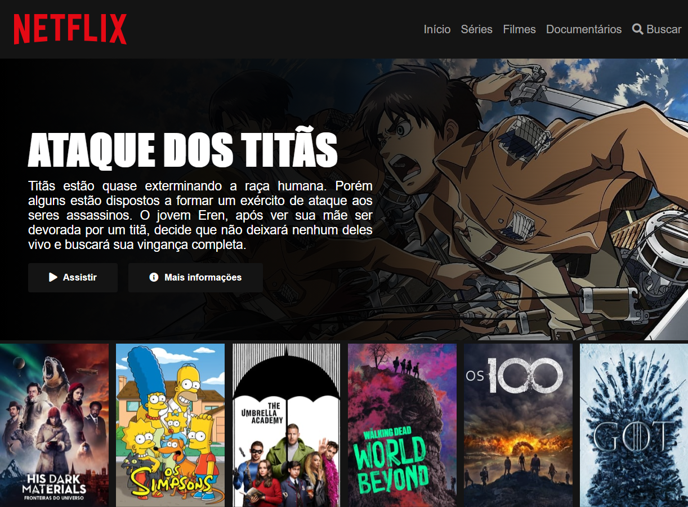

# Página inicial do Instagram

Recriando a interface da Netflix.

Projeto desenvolvido durante o bootcamp HTML Web Developer, da Digital Innovation One.

## Obejetivo
Estruturar um layout utilizando técnicas de CSS3 com containers e variáveis. Posicionar os elementos com Flexbox e como utilizar plugins Jquery a favor da sua aplicação.

## Tecnologias
* Código e Interface: **HTML5**, **CSS3**, **JavaScript**

[pré-visualização - Página principal]

